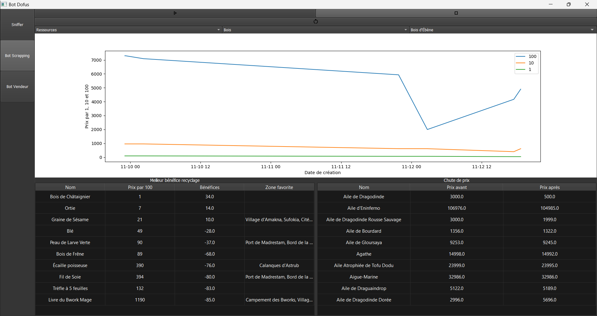

# En cours de développement

# Setup :

- Install Jpexs-decompiler to decompile DofusInvoker.swf : https://github.com/jindrapetrik/jpexs-decompiler
- Create .env file
    - example of .env :
  ```
  D2O_FOLDER="C:\\Users\\valen\\AppData\\Local\\Ankama\\Dofus\\data\\common"
  D2P_FOLDER="C:\\Users\\valen\\AppData\\Local\\Ankama\\Dofus\\content\\gfx\\items"
  D2P_FOLDER2="C:\\Users\\valen\\AppData\\Local\\Ankama\\Dofus\\content\\gfx\\sprites"
  D2I_FILE="C:\\Users\\valen\\AppData\\Local\\Ankama\\Dofus\\data\\i18n\\i18n_fr.d2i"
  DOFUS_INVOKER="C:\\Users\\valen\\AppData\\Local\\Ankama\\Dofus\\DofusInvoker.swf"
  FFDECJAR_PATH="C:\\Program Files (x86)\\FFDec\\ffdec.jar"
  ```
- Launch init.bat to setup environment and
    - Extract DofusInvoker.swf file into action script code
    - Build protocol.pk to get json from network message
    - Create all python class from dofus file with type hint for good autocompletion
    - Unpack d2o and d2i files to translate id to real name
    - Initialize database with d2o and d2i files

# Current state :

- Sniffer

- Scrapping hdv
    - Chart on prices by item
    - Top 10 of best benefits item in nuggets
    - Top 10 of most important price drop
    - FIXME Need to remove value when equal to zero

- Automate sells resource in hdv
    - Vente automatique des objets(ressource/consommable/cosmétique) en hdv
    - Modification automatique des prix des objets (ressource/consommable/cosmétique) en hdv
    - <!> Still in testing

- Automate FM &#8594; WIP

# Technologies :

➡️ 🐍 Python

- SQLAlchemy
- PyQt5

## Bot hdv scrapping :



## Bot hdv selling :


## Sniffer :


