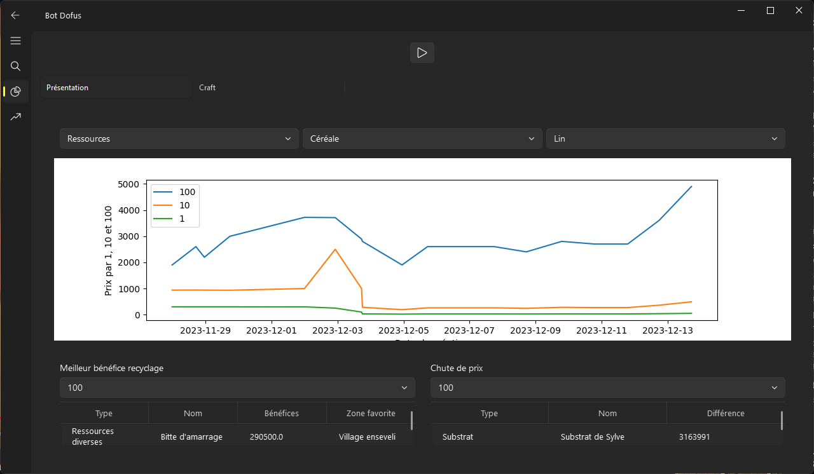
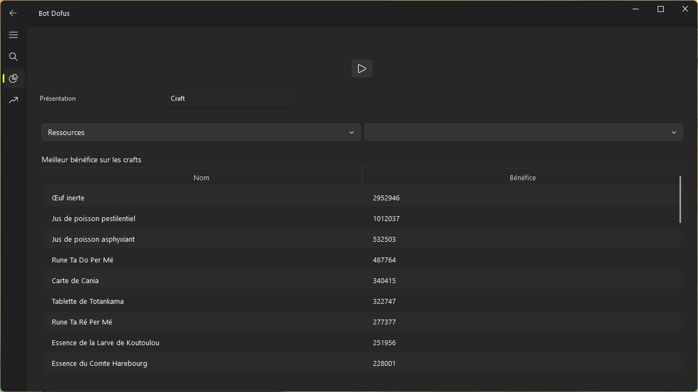
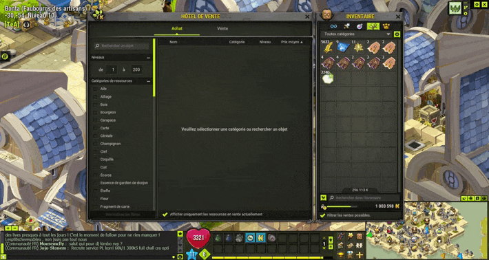
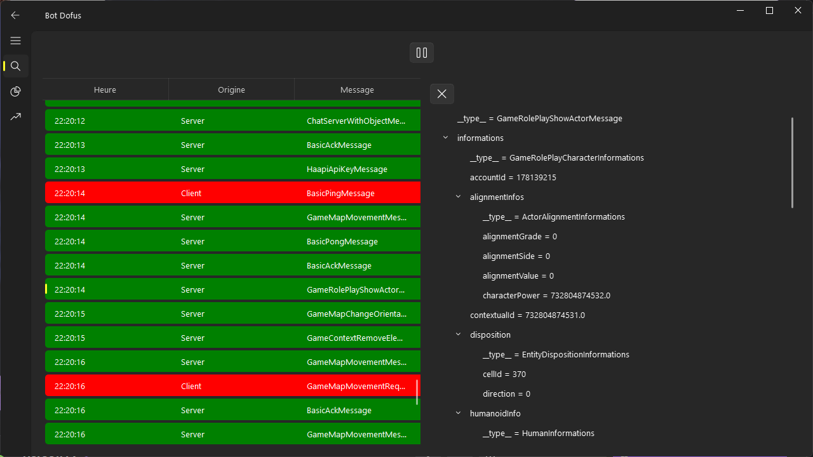

# Setup :

- Désactiver l'ipv6 sur votre pc

- Installer Jpexs-decompiler : https://github.com/jindrapetrik/jpexs-decompiler
- Créer un fichier .env
    - exemple d'un .env :
  ```
  D2O_FOLDER="C:\\Users\\valen\\AppData\\Local\\Ankama\\Dofus\\data\\common"
  D2P_FOLDER="C:\\Users\\valen\\AppData\\Local\\Ankama\\Dofus\\content\\gfx\\items"
  D2P_FOLDER2="C:\\Users\\valen\\AppData\\Local\\Ankama\\Dofus\\content\\gfx\\sprites"
  D2I_FILE="C:\\Users\\valen\\AppData\\Local\\Ankama\\Dofus\\data\\i18n\\i18n_fr.d2i"
  DOFUS_INVOKER="C:\\Users\\valen\\AppData\\Local\\Ankama\\Dofus\\DofusInvoker.swf"
  FFDECJAR_PATH="C:\\Program Files (x86)\\FFDec\\ffdec.jar"
  ```
- Lancer init.bat

# Fonctionnalités :

- Sniffer

- Scrapping de l'hdv
    - Graphique du prix des items au fil du temps
    - Top 10 des meilleurs bénéfices au recyclage des pépites
    - Top 10 des chutes les plus importante de prix

- Automatisation de la vente d'objets en hdv
    - Vente automatique des objets(ressource/consommable/cosmétique) en hdv
    - Modification automatique des prix des objets (ressource/consommable/cosmétique) en hdv

# Technologies :

➡️ 🐍 Python

- SQLAlchemy
- PyQt5

## Bot hdv scrapping :





### Benefit from craft :


## Bot hdv selling :



## Sniffer :


