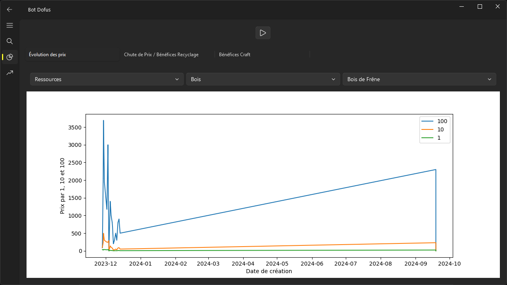
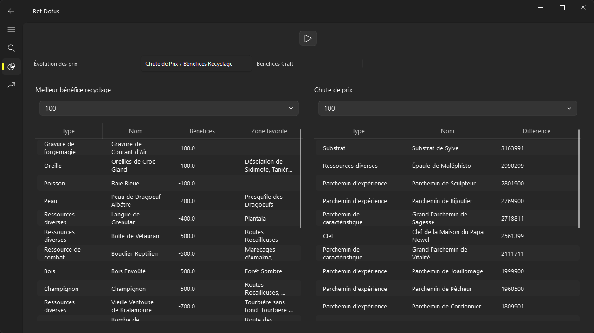
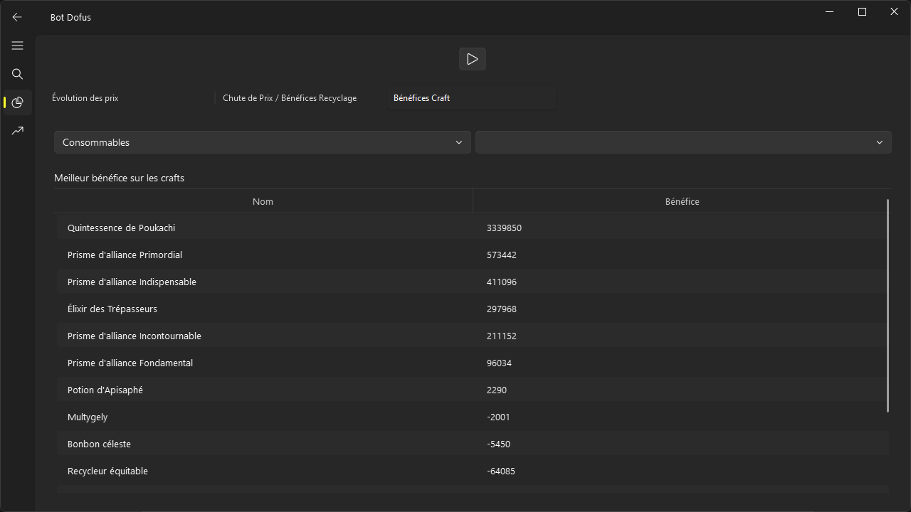
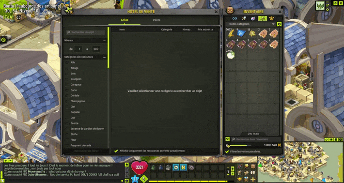
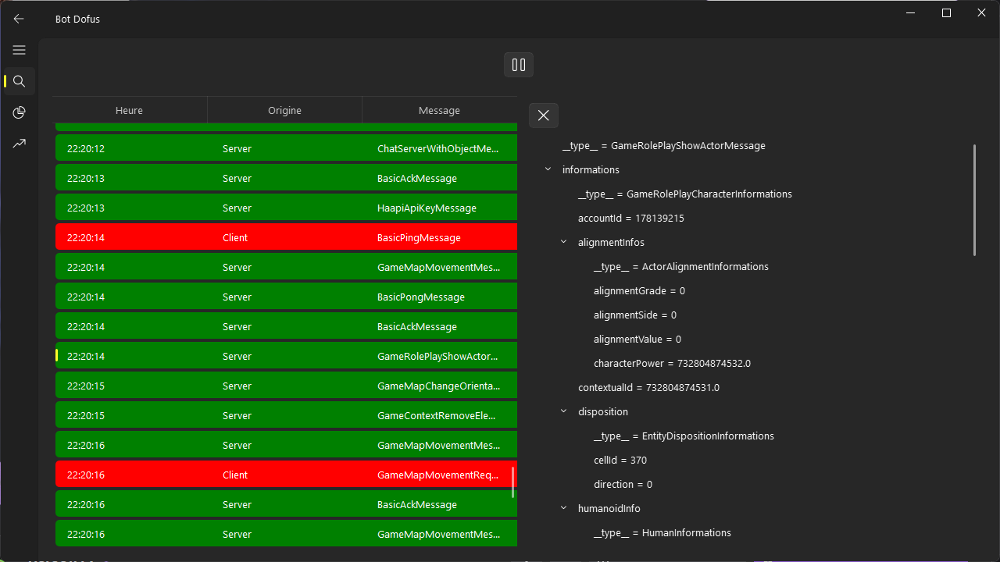

# Setup :

- Disable IPV6 on your PC

- Install Jpexs-decompiler : https://github.com/jindrapetrik/jpexs-decompiler
- Create .env file in app/.env , you can take example of this file app/.env.template :
  ```
  D2O_FOLDER="C:\\Users\\valen\\AppData\\Local\\Ankama\\Dofus\\data\\common"
  D2P_FOLDER="C:\\Users\\valen\\AppData\\Local\\Ankama\\Dofus\\content\\gfx\\items"
  D2P_FOLDER2="C:\\Users\\valen\\AppData\\Local\\Ankama\\Dofus\\content\\gfx\\sprites"
  D2I_FILE="C:\\Users\\valen\\AppData\\Local\\Ankama\\Dofus\\data\\i18n\\i18n_fr.d2i"
  DOFUS_INVOKER="C:\\Users\\valen\\AppData\\Local\\Ankama\\Dofus\\DofusInvoker.swf"
  FFDECJAR_PATH="C:\\Program Files (x86)\\FFDec\\ffdec.jar"
  ```

`init.bat` # Initializes the bot (must be run after each update)

Make sure you have only one instance of the game running.

`start.bat` # Starts the bot

Simply log in with your character (if your character is already connected, you must disconnect and reconnect).

Sometimes the connection may fail and the console might display a strange character like: ▲M
If that happens, it's most likely due to latency. Try again — it should work on a subsequent attempt.

# Features:
All data is stored locally in an SQLite file.
To record item prices, go to an in-game market (HDV) and start the bot from the scrapping page using the play button. Then just wait for the process to complete.

- Sniffer
- HDV Scraping
- Price trend graph over time
- Top 10 most profitable items for nugget recycling
- Top 10 biggest price drops
- Automated item sales in HDV
- Automatic listing of items (resources/consumables/cosmetics) in the market (you must be in the correct sales tab)
- Automatic price adjustment of items (resources/consumables/cosmetics) in the market (you must be in the correct sales tab)

# Technologies :

➡️ 🐍 Python

- SQLAlchemy
- PyQt5

## Evolution of price GUI :



## Loss price on item GUI / Nugget benefit GUI :



## Benefit by craft GUI :



## Sell automation :



## Sniffer GUI :



## Disclaimer
This script is provided for educational and informational purposes only. It was created just for fun. The author is not responsible for any misuse or violation of terms of service resulting from the use of this script. Always stick to terms of service of website you're using.
